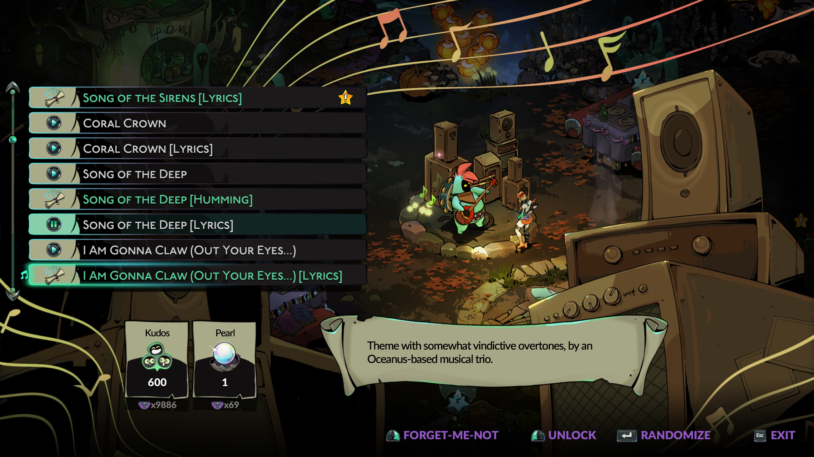

# Crossroad Singing Sirens

This mod adds a total of **12** new lyrical and hummed versions of the songs by Scylla and the Sirens to the Crossroads' Music Maker, allowing you to choose between them whenever you want.
This includes one hummed and lyrical version of the in-biome songs, and the lyrical version of each boss theme.

To unlock a lyrical or hummed version of a song, you first need to own the instrumental version.

## Other related mods

To further improve your musical experience in the Crossroads, consider installing some of my other mods:

- [Randomize Favourite Songs](https://thunderstore.io/c/hades-ii/p/NikkelM/Randomize_Favorite_Songs/) allows you to favourite songs with the Music Maker, and randomize only from those whenever you return to the Crossroads. Supports all songs added by other mods.
- [Crossroads Singing Silver Sisters](https://thunderstore.io/c/hades-ii/p/NikkelM/Crossroads_Singing_Silver_Sisters/) adds lyrical versions of the songs Artemis, Melinoë and Apollo sing in various scenes in the game to the Music Maker.
- [Hades OST for the Music Maker](https://thunderstore.io/c/hades-ii/p/NikkelM/Hades_OST_for_the_Music_Maker/) adds songs from the Hades soundtrack (as played by Orpheus) to the Music Maker.

## Configuration

If you want to immediately get access to all lyrical versions added through this mod, you can set the `unlockEverything` option to `true` in the config file through r2modman.
Note that this action is **NOT REVERSIBLE**!
